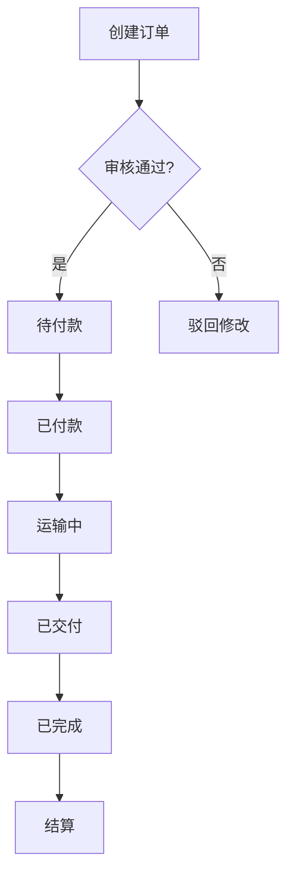

## 1. Product Overview

二手车交易企业 SaaS 管理后台，集成采购、订单、物流仓储、财务结算全流程管理，并预留广告平台对接接口用于用户转化跟踪。测试阶段采用轻量化技术栈，后续可逐步迭代升级。

- **核心功能**: 采购订单管理、销售订单管理、物流仓储管理、财务结算管理、基础资料管理
- **目标用户**: 二手车交易企业的运营人员、财务人员、管理人员
- **市场价值**: 一站式管理二手车交易全流程，提升运营效率，实现数据化决策

## 2. Core Features

### 2.1 User Roles

| Role | Registration Method | Core Permissions |
|------|---------------------|------------------|
| 超级管理员 | 系统初始化创建 | 全部权限，用户管理，系统配置 |
| 运营人员 | 管理员创建 | 订单管理、物流仓储管理、基础资料管理 |
| 财务人员 | 管理员创建 | 结算管理、发票管理、对账单生成 |

### 2.2 Feature Module

1. **首页工作台**: 关键经营指标展示、待办提醒
2. **订单管理**: 采购订单、销售订单全流程管理
3. **物流仓储**: 车辆入库、库位分配、库存盘点、出库管理、在途跟踪
4. **结算管理**: 采购付款、销售收款、服务费结算、佣金计算、发票管理
5. **基础资料**: 车源信息、客户信息、供应商、仓库、用户权限管理
6. **开放 API**: 广告平台对接接口，提供测试验证

### 2.3 Page Details

| Page Name | Module Name | Feature description |
|-----------|-------------|---------------------|
| 首页工作台 | 经营指标卡片 | 展示今日订单量、在途车辆数、待结算金额、库存周转率 |
| 首页工作台 | 待办提醒 | 展示待审核订单、异常订单等待办事项 |
| 订单管理 | 采购订单 | 创建、审核、状态跟踪（待付款、已付款、运输中、已交付、已完成） |
| 订单管理 | 销售订单 | 创建、审核、状态跟踪、合同附件上传 |
| 订单管理 | 异常订单 | 单独处理异常订单，记录处理原因 |
| 物流仓储 | 入库登记 | 车辆入库信息录入、VIN码扫描 |
| 物流仓储 | 库位分配 | 自动/手动分配库位，库位状态管理 |
| 物流仓储 | 库存盘点 | 定期盘点、差异记录、盘点报告 |
| 物流仓储 | 出库管理 | 出库申请、审批、车辆放行 |
| 物流仓储 | 在途跟踪 | 对接第三方物流平台，实时查看运输轨迹 |
| 结算管理 | 采购付款 | 付款申请、审批、付款记录 |
| 结算管理 | 销售收款 | 收款登记、对账、收款记录 |
| 结算管理 | 服务费结算 | 平台服务费计算、结算记录 |
| 结算管理 | 佣金计算 | 销售人员佣金计算、发放记录 |
| 结算管理 | 发票管理 | 发票开具、作废、红冲、台账管理 |
| 结算管理 | 对账单 | 按车源方/客户维度生成对账单 |
| 基础资料 | 车源信息 | 品牌、车型、车系、年款、VIN码管理 |
| 基础资料 | 客户信息 | 个人/企业客户信息管理 |
| 基础资料 | 供应商 | 供应商信息管理 |
| 基础资料 | 仓库 | 仓库信息、库位管理 |
| 基础资料 | 用户权限 | 系统用户管理、角色权限配置 |
| 开放 API | 接口测试 | 广告平台对接接口验证，测试数据提交 |

## 3. Core Process

### 采购订单流程
1. 创建采购订单 → 2. 审核订单 → 3. 待付款 → 4. 已付款 → 5. 运输中 → 6. 已交付 → 7. 已完成

### 销售订单流程
1. 创建销售订单 → 2. 审核订单 → 3. 待付款 → 4. 已付款 → 5. 运输中 → 6. 已交付 → 7. 已完成

### 车辆入库流程
1. 入库申请 → 2. 库位分配 → 3. 车辆验收 → 4. 入库完成

### 结算流程
1. 订单完成 → 2. 生成结算单 → 3. 审核结算单 → 4. 付款/收款 → 5. 发票开具 → 6. 完成

## 4. User Interface Design

### 4.1 Design Style

- **主色调**: 深蓝色系 (#1e40af)，体现专业、稳重
- **辅助色**: 橙色 (#f97316)，用于强调和操作按钮
- **中性色**: 灰色系 (#64748b, #94a3b8, #e2e8f0)
- **按钮风格**: 圆角矩形，hover 状态有阴影变化
- **字体**: 思源黑体，标题粗体，正文常规
- **布局风格**: 侧边栏导航 + 顶部面包屑 + 内容区卡片式布局
- **图标风格**: 线性图标，统一风格

### 4.2 Page Design Overview

| Page Name | Module Name | UI Elements |
|-----------|-------------|-------------|
| 首页工作台 | 指标卡片 | 四个统计卡片，带数字动画，图表展示趋势 |
| 首页工作台 | 待办提醒 | 列表形式，带优先级标识，快速跳转链接 |
| 订单管理 | 订单列表 | 表格展示，支持筛选、搜索、分页 |
| 订单管理 | 订单详情 | 卡片布局，状态流转时间线 |
| 物流仓储 | 库位管理 | 网格视图展示库位状态，颜色区分 |
| 结算管理 | 结算列表 | 表格展示，金额高亮 |
| 基础资料 | 数据表格 | 标准数据表格，支持增删改查 |

### 4.3 Responsiveness

- **桌面优先**: 1920x1080 设计
- **响应式适配**: 1280px 以下侧边栏折叠，800px 以下移动端布局

### 4.4 3D Scene Guidance

不适用
