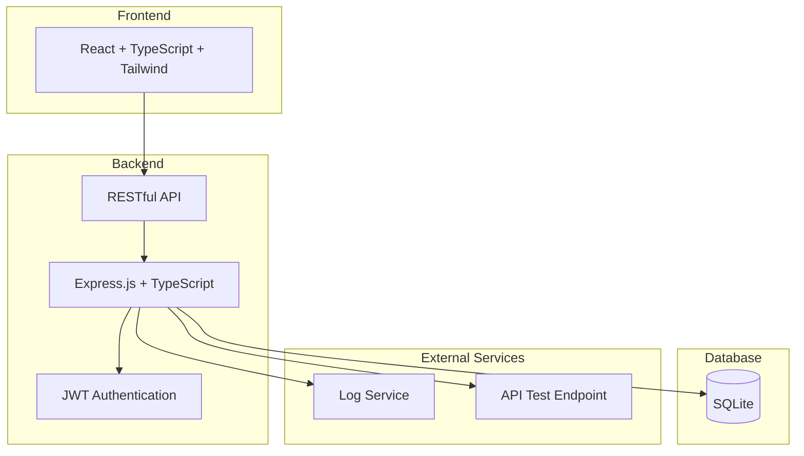
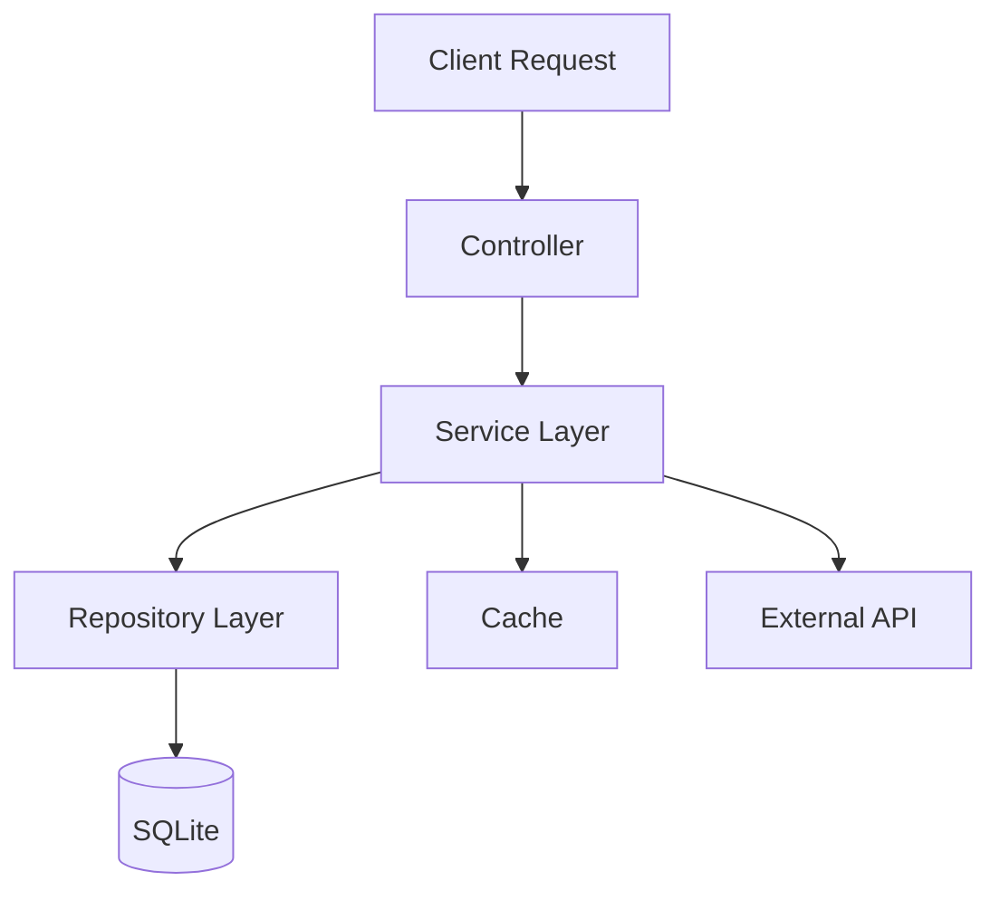

## 1. Architecture Design



## 2. Technology Description

- **Frontend**: React@18 + TypeScript + TailwindCSS@3 + Vite
- **Backend**: Express.js@4 + TypeScript
- **Database**: SQLite (测试阶段轻量化)
- **Authentication**: JWT
- **State Management**: Zustand
- **Routing**: React Router DOM
- **Icons**: Lucide React

## 3. Route Definitions

| Route | Purpose |
|-------|---------|
| / | 首页工作台 |
| /orders/purchase | 采购订单管理 |
| /orders/sales | 销售订单管理 |
| /orders/abnormal | 异常订单处理 |
| /warehouse/inbound | 入库登记 |
| /warehouse/alloc | 库位分配 |
| /warehouse/inventory | 库存盘点 |
| /warehouse/outbound | 出库管理 |
| /warehouse/tracking | 在途跟踪 |
| /settlement/purchase | 采购付款 |
| /settlement/sales | 销售收款 |
| /settlement/service | 服务费结算 |
| /settlement/commission | 佣金计算 |
| /settlement/invoice | 发票管理 |
| /settlement/statement | 对账单 |
| /master/cars | 车源信息 |
| /master/customers | 客户信息 |
| /master/suppliers | 供应商管理 |
| /master/warehouses | 仓库管理 |
| /master/users | 用户权限管理 |
| /api/test | API接口测试 |

## 4. API Definitions

### 4.1 Authentication

| Method | Endpoint | Description |
|--------|----------|-------------|
| POST | /api/auth/login | 用户登录 |
| GET | /api/auth/me | 获取当前用户 |
| POST | /api/auth/logout | 用户登出 |

### 4.2 Orders

| Method | Endpoint | Description |
|--------|----------|-------------|
| GET | /api/orders/purchase | 获取采购订单列表 |
| POST | /api/orders/purchase | 创建采购订单 |
| GET | /api/orders/purchase/:id | 获取采购订单详情 |
| PUT | /api/orders/purchase/:id | 更新采购订单 |
| PUT | /api/orders/purchase/:id/status | 更新订单状态 |
| GET | /api/orders/sales | 获取销售订单列表 |
| POST | /api/orders/sales | 创建销售订单 |
| GET | /api/orders/sales/:id | 获取销售订单详情 |
| PUT | /api/orders/sales/:id | 更新销售订单 |
| PUT | /api/orders/sales/:id/status | 更新订单状态 |
| POST | /api/orders/sales/:id/attachments | 上传合同附件 |
| GET | /api/orders/abnormal | 获取异常订单列表 |
| PUT | /api/orders/abnormal/:id/handle | 处理异常订单 |

### 4.3 Warehouse

| Method | Endpoint | Description |
|--------|----------|-------------|
| POST | /api/warehouse/inbound | 车辆入库 |
| GET | /api/warehouse/inbound | 获取入库记录 |
| POST | /api/warehouse/alloc | 库位分配 |
| GET | /api/warehouse/locations | 获取库位列表 |
| POST | /api/warehouse/inventory | 创建盘点任务 |
| GET | /api/warehouse/inventory | 获取盘点列表 |
| POST | /api/warehouse/outbound | 车辆出库 |
| GET | /api/warehouse/outbound | 获取出库记录 |
| GET | /api/warehouse/tracking/:orderId | 获取运输轨迹 |

### 4.4 Settlement

| Method | Endpoint | Description |
|--------|----------|-------------|
| POST | /api/settlement/purchase | 创建付款申请 |
| GET | /api/settlement/purchase | 获取付款列表 |
| POST | /api/settlement/sales | 创建收款记录 |
| GET | /api/settlement/sales | 获取收款列表 |
| POST | /api/settlement/service | 服务费结算 |
| GET | /api/settlement/service | 获取服务费列表 |
| POST | /api/settlement/commission | 佣金计算 |
| GET | /api/settlement/commission | 获取佣金列表 |
| POST | /api/settlement/invoice | 开具发票 |
| GET | /api/settlement/invoice | 获取发票列表 |
| GET | /api/settlement/statement | 生成对账单 |

### 4.5 Master Data

| Method | Endpoint | Description |
|--------|----------|-------------|
| CRUD | /api/master/car-brands | 车品牌管理 |
| CRUD | /api/master/car-models | 车型管理 |
| CRUD | /api/master/car-series | 车系管理 |
| CRUD | /api/master/cars | 车辆信息管理 |
| CRUD | /api/master/customers | 客户信息管理 |
| CRUD | /api/master/suppliers | 供应商管理 |
| CRUD | /api/master/warehouses | 仓库管理 |
| CRUD | /api/master/users | 用户管理 |
| CRUD | /api/master/roles | 角色管理 |

### 4.6 Open API (广告平台对接)

| Method | Endpoint | Description |
|--------|----------|-------------|
| POST | /api/open/lead | 接收广告平台线索 |
| GET | /api/open/lead/:id | 获取线索详情 |
| PUT | /api/open/lead/:id/status | 更新线索状态 |
| GET | /api/open/test | API健康检查 |

## 5. Server Architecture Diagram



## 6. Data Model

### 6.1 Data Model Definition

```mermaid
erDiagram
    USER ||--o{ ORDER : creates
    USER ||--o{ SETTLEMENT : handles
    SUPPLIER ||--o{ PURCHASE_ORDER : supplies
    CUSTOMER ||--o{ SALES_ORDER : buys
    CAR ||--o{ INVENTORY : stored_in
    CAR ||--o{ ORDER_ITEM : included_in
    WAREHOUSE ||--o{ LOCATION : has
    LOCATION ||--o{ INVENTORY : assigned_to
    
    USER {
        integer id PK
        string username
        string password
        string role
        string email
        datetime created_at
        datetime updated_at
    }
    
    ROLE {
        integer id PK
        string name
        string permissions
        datetime created_at
    }
    
    CAR_BRAND {
        integer id PK
        string name
        datetime created_at
    }
    
    CAR_MODEL {
        integer id PK
        integer brand_id FK
        string name
        datetime created_at
    }
    
    CAR_SERIES {
        integer id PK
        integer model_id FK
        string name
        datetime created_at
    }
    
    CAR {
        integer id PK
        string vin
        string license_plate
        integer brand_id FK
        integer model_id FK
        integer series_id FK
        integer year
        string color
        integer mileage
        decimal price
        datetime created_at
    }
    
    CUSTOMER {
        integer id PK
        string type
        string name
        string phone
        string email
        string address
        string tax_id
        datetime created_at
    }
    
    SUPPLIER {
        integer id PK
        string name
        string contact
        string phone
        string address
        string tax_id
        datetime created_at
    }
    
    WAREHOUSE {
        integer id PK
        string name
        string address
        string manager
        datetime created_at
    }
    
    LOCATION {
        integer id PK
        integer warehouse_id FK
        string code
        string status
        datetime created_at
    }
    
    ORDER {
        integer id PK
        string order_no
        string type
        integer user_id FK
        integer customer_id FK
        integer supplier_id FK
        string status
        decimal total_amount
        datetime created_at
        datetime updated_at
    }
    
    ORDER_ITEM {
        integer id PK
        integer order_id FK
        integer car_id FK
        decimal price
        integer quantity
        datetime created_at
    }
    
    ORDER_ATTACHMENT {
        integer id PK
        integer order_id FK
        string file_name
        string file_path
        datetime created_at
    }
    
    INVENTORY {
        integer id PK
        integer car_id FK
        integer location_id FK
        string status
        datetime inbound_at
        datetime outbound_at
        datetime created_at
    }
    
    SETTLEMENT {
        integer id PK
        string type
        integer order_id FK
        integer user_id FK
        decimal amount
        string status
        datetime created_at
        datetime updated_at
    }
    
    INVOICE {
        integer id PK
        string invoice_no
        integer settlement_id FK
        decimal amount
        string type
        string status
        datetime issued_at
        datetime created_at
    }
    
    LEAD {
        integer id PK
        string source
        string phone
        string name
        string car_info
        string status
        datetime created_at
        datetime updated_at
    }
```



### 6.2 Data Definition Language

```sql
CREATE TABLE users (
    id INTEGER PRIMARY KEY AUTOINCREMENT,
    username VARCHAR(50) NOT NULL UNIQUE,
    password VARCHAR(255) NOT NULL,
    role VARCHAR(20) NOT NULL,
    email VARCHAR(100),
    created_at DATETIME DEFAULT CURRENT_TIMESTAMP,
    updated_at DATETIME DEFAULT CURRENT_TIMESTAMP
);

CREATE TABLE roles (
    id INTEGER PRIMARY KEY AUTOINCREMENT,
    name VARCHAR(50) NOT NULL UNIQUE,
    permissions TEXT,
    created_at DATETIME DEFAULT CURRENT_TIMESTAMP
);

CREATE TABLE car_brands (
    id INTEGER PRIMARY KEY AUTOINCREMENT,
    name VARCHAR(50) NOT NULL UNIQUE,
    created_at DATETIME DEFAULT CURRENT_TIMESTAMP
);

CREATE TABLE car_models (
    id INTEGER PRIMARY KEY AUTOINCREMENT,
    brand_id INTEGER NOT NULL,
    name VARCHAR(50) NOT NULL,
    FOREIGN KEY (brand_id) REFERENCES car_brands(id),
    created_at DATETIME DEFAULT CURRENT_TIMESTAMP
);

CREATE TABLE car_series (
    id INTEGER PRIMARY KEY AUTOINCREMENT,
    model_id INTEGER NOT NULL,
    name VARCHAR(50) NOT NULL,
    FOREIGN KEY (model_id) REFERENCES car_models(id),
    created_at DATETIME DEFAULT CURRENT_TIMESTAMP
);

CREATE TABLE cars (
    id INTEGER PRIMARY KEY AUTOINCREMENT,
    vin VARCHAR(17) NOT NULL UNIQUE,
    license_plate VARCHAR(20),
    brand_id INTEGER NOT NULL,
    model_id INTEGER NOT NULL,
    series_id INTEGER NOT NULL,
    year INTEGER,
    color VARCHAR(20),
    mileage INTEGER,
    price DECIMAL(12,2),
    FOREIGN KEY (brand_id) REFERENCES car_brands(id),
    FOREIGN KEY (model_id) REFERENCES car_models(id),
    FOREIGN KEY (series_id) REFERENCES car_series(id),
    created_at DATETIME DEFAULT CURRENT_TIMESTAMP
);

CREATE TABLE customers (
    id INTEGER PRIMARY KEY AUTOINCREMENT,
    type VARCHAR(10) NOT NULL,
    name VARCHAR(100) NOT NULL,
    phone VARCHAR(20),
    email VARCHAR(100),
    address TEXT,
    tax_id VARCHAR(50),
    created_at DATETIME DEFAULT CURRENT_TIMESTAMP
);

CREATE TABLE suppliers (
    id INTEGER PRIMARY KEY AUTOINCREMENT,
    name VARCHAR(100) NOT NULL,
    contact VARCHAR(50),
    phone VARCHAR(20),
    address TEXT,
    tax_id VARCHAR(50),
    created_at DATETIME DEFAULT CURRENT_TIMESTAMP
);

CREATE TABLE warehouses (
    id INTEGER PRIMARY KEY AUTOINCREMENT,
    name VARCHAR(100) NOT NULL,
    address TEXT,
    manager VARCHAR(50),
    created_at DATETIME DEFAULT CURRENT_TIMESTAMP
);

CREATE TABLE locations (
    id INTEGER PRIMARY KEY AUTOINCREMENT,
    warehouse_id INTEGER NOT NULL,
    code VARCHAR(20) NOT NULL,
    status VARCHAR(20) DEFAULT 'empty',
    FOREIGN KEY (warehouse_id) REFERENCES warehouses(id),
    created_at DATETIME DEFAULT CURRENT_TIMESTAMP
);

CREATE TABLE orders (
    id INTEGER PRIMARY KEY AUTOINCREMENT,
    order_no VARCHAR(50) NOT NULL UNIQUE,
    type VARCHAR(20) NOT NULL,
    user_id INTEGER NOT NULL,
    customer_id INTEGER,
    supplier_id INTEGER,
    status VARCHAR(20) DEFAULT 'pending',
    total_amount DECIMAL(12,2) NOT NULL,
    FOREIGN KEY (user_id) REFERENCES users(id),
    FOREIGN KEY (customer_id) REFERENCES customers(id),
    FOREIGN KEY (supplier_id) REFERENCES suppliers(id),
    created_at DATETIME DEFAULT CURRENT_TIMESTAMP,
    updated_at DATETIME DEFAULT CURRENT_TIMESTAMP
);

CREATE TABLE order_items (
    id INTEGER PRIMARY KEY AUTOINCREMENT,
    order_id INTEGER NOT NULL,
    car_id INTEGER NOT NULL,
    price DECIMAL(12,2) NOT NULL,
    quantity INTEGER DEFAULT 1,
    FOREIGN KEY (order_id) REFERENCES orders(id),
    FOREIGN KEY (car_id) REFERENCES cars(id),
    created_at DATETIME DEFAULT CURRENT_TIMESTAMP
);

CREATE TABLE order_attachments (
    id INTEGER PRIMARY KEY AUTOINCREMENT,
    order_id INTEGER NOT NULL,
    file_name VARCHAR(255) NOT NULL,
    file_path VARCHAR(500) NOT NULL,
    FOREIGN KEY (order_id) REFERENCES orders(id),
    created_at DATETIME DEFAULT CURRENT_TIMESTAMP
);

CREATE TABLE inventory (
    id INTEGER PRIMARY KEY AUTOINCREMENT,
    car_id INTEGER NOT NULL UNIQUE,
    location_id INTEGER,
    status VARCHAR(20) DEFAULT 'in_stock',
    inbound_at DATETIME,
    outbound_at DATETIME,
    FOREIGN KEY (car_id) REFERENCES cars(id),
    FOREIGN KEY (location_id) REFERENCES locations(id),
    created_at DATETIME DEFAULT CURRENT_TIMESTAMP
);

CREATE TABLE settlements (
    id INTEGER PRIMARY KEY AUTOINCREMENT,
    type VARCHAR(20) NOT NULL,
    order_id INTEGER,
    user_id INTEGER NOT NULL,
    amount DECIMAL(12,2) NOT NULL,
    status VARCHAR(20) DEFAULT 'pending',
    FOREIGN KEY (order_id) REFERENCES orders(id),
    FOREIGN KEY (user_id) REFERENCES users(id),
    created_at DATETIME DEFAULT CURRENT_TIMESTAMP,
    updated_at DATETIME DEFAULT CURRENT_TIMESTAMP
);

CREATE TABLE invoices (
    id INTEGER PRIMARY KEY AUTOINCREMENT,
    invoice_no VARCHAR(50) NOT NULL UNIQUE,
    settlement_id INTEGER NOT NULL,
    amount DECIMAL(12,2) NOT NULL,
    type VARCHAR(20) NOT NULL,
    status VARCHAR(20) DEFAULT 'issued',
    issued_at DATETIME,
    FOREIGN KEY (settlement_id) REFERENCES settlements(id),
    created_at DATETIME DEFAULT CURRENT_TIMESTAMP
);

CREATE TABLE leads (
    id INTEGER PRIMARY KEY AUTOINCREMENT,
    source VARCHAR(50) NOT NULL,
    phone VARCHAR(20),
    name VARCHAR(50),
    car_info TEXT,
    status VARCHAR(20) DEFAULT 'new',
    created_at DATETIME DEFAULT CURRENT_TIMESTAMP,
    updated_at DATETIME DEFAULT CURRENT_TIMESTAMP
);

INSERT INTO users (username, password, role, email) VALUES ('admin', '$2b$10$N9qo8uLOickgx2ZMRZoMye.IjzqAKL9xL5jvMFVdNJHvGCgTq/VEq', 'admin', 'admin@example.com');

INSERT INTO car_brands (name) VALUES ('宝马'), ('奔驰'), ('奥迪'), ('大众'), ('丰田'), ('本田');

INSERT INTO car_models (brand_id, name) VALUES (1, '3系'), (1, '5系'), (1, 'X3'), (2, 'C级'), (2, 'E级'), (2, 'GLC');
```
